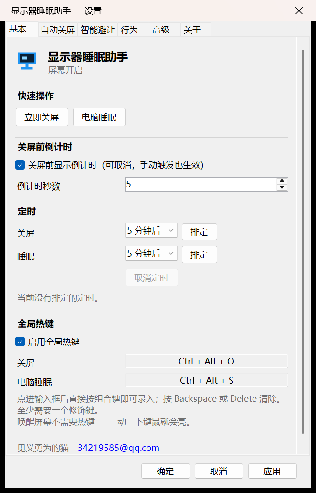

# 显示器睡眠助手

**一个 Windows 托盘小工具：想省电时一键关掉显示器或让电脑睡眠，不该关的时候绝不关。**

Windows 自带的「N 分钟后关闭显示」是个死板计时器 —— 看视频、开会、跑全屏程序时照关不误。
本程序会先判断「现在该不该关」，看完视频、开完会再关。

不需要管理员权限，不依赖任何第三方库。

## 能做什么

1. **立即关屏 / 立即睡眠** —— 点一下马上执行，想省电就省
2. **倒计时执行** —— 设 5 到 120 分钟，到点自动关屏或睡眠，中途随时能取消
3. **热键操作** —— 不用去点托盘：`Ctrl + Alt + O` 关屏，`Ctrl + Alt + S` 睡眠

关屏和睡眠都会先弹一个倒计时，**按 `ESC` 可以取消**。
想唤醒？动一下键鼠就行，不需要任何操作。

## 快速开始

到 [Releases](https://github.com/window227/MonitorSleep/releases) 下载 zip 解压，
双击里面的 `MonitorSleep.exe`，程序会常驻托盘。

> 需要 **.NET 8 桌面运行时**。没装的话去微软官网搜 ".NET Desktop Runtime 8"。

**看不到托盘图标？** Windows 11 默认把新出现的图标折叠进右下角的 `^` 里，点开就能找到。
想让它常驻：右键任务栏 → 任务栏设置 → **其他系统托盘图标** → 把本程序打开。

> 双击 `MonitorSleep.exe` 也会直接打开设置窗口，图标被藏起来也不影响使用。

## 更多文档

| 文件 | 内容 |
|---|---|
| [USAGE.md](USAGE.md) | 完整说明 —— 每个选项的含义、设计取舍、常见问题、构建方式 |
| [CHANGELOG.md](CHANGELOG.md) | 版本变更记录 |

## 许可证

[GPL-3.0](LICENSE)
